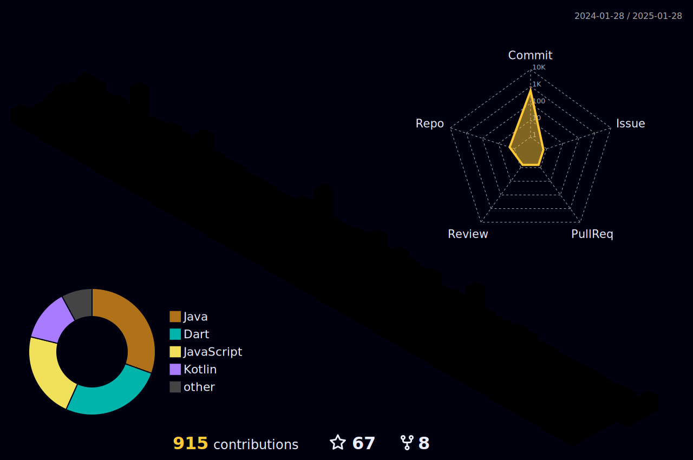

 

 

 
 

  <ul align="center">
    
  </ul>

 

- 🧑‍🎓 I'm currently a **Final year computer engineering student from India.**
  
- 🔭 Currently working on **Full-Stack Web Development, Native Android + Cross-Platfrom Application Development && Serverless Computing.**

- 🌱 Currently learning **Cloud Computing, Dev-Ops && Machine Learning.**

- 💬 Ask me about **Native Android || Flutter Application Development.**

- 👓 Interested in **System Engineering.**
  
- 📫 Feel free to reach me out **ak2341776@gmail.com**

 

<table align="center">
  <tr>
    <td colspan="2" align="center">
      

        <ul align="center">
          <h1 style="display: inline-block">My GitHub Stats 😼</h1>
        </ul>
      

    </td>
  </tr>
  
  <tr border="none">
    <td width="50%" align="center">
       
      
      

       
       
       
    </td>
    <td width="50%" align="center">
       
      
       
       
    </td>
  </tr>

  <tr>
    <td colspan="2">
      
    </td>
  </tr>

  <tr align="center">
    <td colspan="2">
      

        <h1 style="display: inline-block">Trophies 🏆</h1>
         
        

          
        

      

    </td>
  </tr>
</table>

 

  <ul align="center">
    <h1 style="display: inline-block">Technologies I Know 👨🏻‍💻</h1>
  </ul>

  
### Programming Languages

  
  

### Full-Stack Web Development

  
  
  
  
  
  
  
  
  
  

### Mobile Application Development

  
  
  
  
  
  

### Databases

  
  

### Machine Learning
 

  
  

### Cloud Computing
 

  
  

### Version Control System

  
  

### IDEs

  
  
  

### Operating Systems

  
  
  

### DevOps

  

  <ul align="center">
    <h1 style="display: inline-block">Connect with Me 🤝</h1>
  </ul>

  
  
  
  

  

